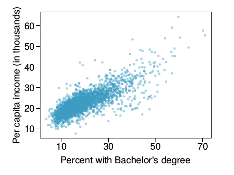

<!-- This syntax can be used to add comments that are ignored during knitting process. -->

##### Collaborators: 

##### Instructions: #####

Before beginning this assignment, please ensure you have access to R and RStudio. 

1. Download the `problemset3.Rmd` file from Canvas. Open `problemset3.Rmd` in RStudio and supply your solutions to the assignment by editing `problemset3.Rmd`. 

2. Replace the "Insert Your Name Here" text in the `author:` field with your own full name. Any collaborators must be listed on the top of your assignment. 

3. Be sure to include well-documented (e.g. commented) code chucks, figures and clearly written text chunk explanations as necessary. Any figures should be clearly labeled and appropriately referenced within the text. 

4. Collaboration on problem sets is acceptable, and even encouraged, but each student must turn in an individual write-up in his or her own words and his or her own work. The names of all collaborators must be listed on each assignment. Do not copy-and-paste from other students' responses or code.

5. When you have completed the assignment and have **checked** that your code both runs in the Console and knits correctly when you click `Knit PDF`, rename the R Markdown file to `YourLastName_YourFirstName_ps3.Rmd`, knit a PDF and submit the PDF file on Canvas.

##### Setup: #####

In this problem set you will need, at minimum, the following R packages.

```{r Setup, message=FALSE}
# Load standard libraries
library(tidyverse)
```

#### Problem 1: Flight Delays  ####

Flight delays are often linked to weather conditions. How does weather impact flights from NYC? Utilize both the `flights` and `weather` datasets from the `nycflights13` package to explore this question. Include at least two visualizations to aid in communicating what you find.

```{r}
#nycflights13::flights
?nycflights13::weather
#table(nycflights13::flights$year)
#table(nycflights13::weather$origin)
a <- names(nycflights13::flights)
b <- names(nycflights13::weather)
intersect(a,b)
setdiff(a,b)

flightweather <- left_join(nycflights13::flights, nycflights13::weather, c("year","month","day","origin","hour","time_hour"))
flightweather<- flightweather %>% filter(arr_delay >=0, dep_delay>=0)
flightweather$delay <- (flightweather$arr_delay+ flightweather$dep_delay)
#names(flightweather)
#unique(flightweather$month)
fwdata <- select(flightweather, origin, arr_delay, dep_delay, delay, temp, dewp, humid,wind_dir, wind_speed, wind_gust, precip, pressure, visib)

fwdata_1 <- na.omit(fwdata) 
#fwdata_1 %>% arrange(desc(humid))
#fwdata_1


ggplot(fwdata_1)+ geom_smooth (aes(x=temp, y= delay))
ggplot(fwdata_1)+ geom_smooth (aes(x=temp, y= delay, col = origin))
ggplot(fwdata_1)+ geom_point (aes(x=temp, y= delay, col = origin))

ggplot(fwdata_1)+ geom_smooth (aes(x=humid, y= delay))
ggplot(fwdata_1)+ geom_smooth (aes(x=humid, y= delay, colour = origin))
ggplot(fwdata_1)+ geom_point (aes(x=humid, y= delay))


```
Weather factors like temperature and humidity seem to participate and impact the flight delays.
 1) In case of temperature, it shows that with a higher temperature there is a higher delay and even lower temperature has a bit more of delay than the temperature range between 20 - 40 F. The smoother tail shoots up cause of extreme outliers which are days that saw extreme delay due to maybe reasons outside the purview of the data set variables.
 2) In case of humidity, there's more delay with less humidity. As humidity increases the delay decreases until the point (humidity ~ 50) where the delay again start increasing with humidity and all the three NYC airports of the dataset follow the same trend.


#### Problem 2: 50 States in the USA ####

In this problem we will use the `state` dataset, available as part of the R statistical computing platforms. This data is related to the 50 states of the United States of America. Load the data and use it to answer the following questions. 

##### (a) Describe the data and each variable it contains. Tidy the data, preparing it for a data analysis. 

```{r}

#data(state)
#state.abb
#state.area
#state.division
#state.name
#state.region
#state.center

?state.x77
state <- as.data.frame(state.x77)
#names(state)

#rename(state, c("rownames(state)"="state_name","Population"="population", "Income"="incomepc", #"Illiteracy"="illiteracy_percentage", "Life Exp"="life_expectancy","Murder"="murder_rate", "HS Grad"="hsgrad_percentage", "Frost"="mean_frostdays", "Area"="area_sqmiles"))

state <- cbind(rownames(state), state)
rownames(state) <- NULL
colnames(state) <- c("state_name","population", "incomepc", "illiteracy_percentage", "life_expectancy","murder_rate", "hsgrad_percentage", "mean_frostdays", "area_sqmiles")
state %>% arrange((hsgrad_percentage))


```

The 'state' dataset is related to the 50 states of the US states facts. It contains abbreviations for the state names, numeric vector of state areas, the approximate geographic center of each state, factor giving state divisions, vector giving the full state names, factor giving the region and a matrix with 50 rows and 8 columns giving the following statistics in the respective columns:
a)Population: Gives a number on population estimate as of July 1, 1975
b)Income: Describes per capita income (1974)
c)Illiteracy: defines Illiteracy rate (1970, percent of population)
d)Life Exp: Describes life expectancy in years (1969–71)
e)Murder: Provides murder and non-negligent manslaughter rate per 100,000 population (1976)
f)HS Grad: Provided percentage of high-school graduates (1970)
g)Frost: Gives out the mean number of days with minimum temperature below freezing (1931–1960) in capital or large city
h)Area: Provides land area in square miles

##### (b) Suppose you want to explore the relationship between a state's `HS Grad` rate and other characteristics of the state, for example income, illiteracy rate, and more. Begin by examine the bivariate relationships present in the data. What does your analysis suggest might be important varibles to consider in building a model to explain variation in highschool graduation rates?

```{r}
#names(state)
#state %>% arrange((life_expectancy))

# HS Graduation rate vs income per capita
ggplot(state)+ geom_boxplot(aes(y=incomepc, x=cut_interval(hsgrad_percentage,6), col= cut_interval(hsgrad_percentage,6)))           
ggplot(state)+ geom_smooth (aes(x=incomepc, y =hsgrad_percentage))

# HS Graduation rate vs life expectancy
ggplot(state) +geom_boxplot(aes(y=hsgrad_percentage, x =cut_interval(life_expectancy,6), col=cut_interval(life_expectancy,6)))         
ggplot(state) +geom_smooth(aes(y=hsgrad_percentage, x =life_expectancy))

# HS Graduation rate vs murder rate
ggplot(state)+ geom_boxplot(aes(y=murder_rate, x=cut_interval(hsgrad_percentage,6), col= cut_interval(hsgrad_percentage,6)))           
ggplot(state)+ geom_smooth(aes(x=murder_rate, y=hsgrad_percentage))

```


Specifically, the important variables to consider in building a model to explain variation in high school graduation rates are Income (per capita), Life Expectancy and Murder rate. 

1) There's a slight increase in the income with an increase in the percent of high-school graduates. Also, the smoother tail broadens up in the end because of outliers, maybe due to reasons outside the purview of the data set variables.
2) There's a clear increase in the life expectancy with an increase in the percent of high-school graduates. Also, the smoother tail shoots up/falls down in the end cause of a few outlier data of states.
3) The rate of murder increase as the high school graduate percent decreases with a few outliers causing the smooth tail to shoot up (high profile murders/theft and murder/etc). The cause of these few outliers might be some reasons which are outside the purview of the data set variables.

##### (c) Develop a new research question of your own that you can address using the `state` dataset. Clearly state the question you are going to address. Provide at least one visualization to support your exploration of this question. Discuss what you find.

Question:
What kind of relationship exists between Income per capita in states with variables like "HS Grad", "Murder", "Population" with respect to a region? Also, what are the regional mean values of variables mentioned?


```{r}


##ggplot(state,aes(x=incomepc, y =murder_rate, col= state_name, label=state_name)) +geom_point() + geom_text(size=2, check_overlap = TRUE)


state_name <- as.data.frame(state.name)
state_region <- as.data.frame(state.region)
streg <- data.frame(state_name,state_region)
colnames(streg) <- c("state_name", "state_region")
region <-right_join(streg,state, by ="state_name")


# Relationship with more clarity on various geographical regions
ggplot(region,aes(x=incomepc, y =hsgrad_percentage, col= state_region, shape = state_region, label=state_name)) +geom_point()+ geom_text(size=2, check_overlap = TRUE)

ggplot(region, aes(x=incomepc, y =murder_rate, col= state_region, shape = state_region, label=state_name)) +geom_point()+ geom_text(size=2, check_overlap = TRUE)

ggplot(region, aes(x=incomepc, y =population, col= state_region, shape = state_region, label=state_name)) +geom_point()+ geom_text(size=2, check_overlap = TRUE) 


# Mean Values
ggplot(region %>% group_by(state_region) %>% summarise(meangrad = mean(hsgrad_percentage))) + geom_point(aes(x=state_region, y=meangrad, col=state_region, shape= state_region))

ggplot(region %>% group_by(state_region) %>% summarise(meanmurderrate = mean(murder_rate))) +
geom_point(aes(x=state_region, y=meanmurderrate, col=state_region, shape= state_region))

ggplot(region %>% group_by(state_region) %>% summarise(mean_population = mean(population))) +
geom_point(aes(x=state_region, y=mean_population, col=state_region, shape= state_region))


```
1) There's a sharp reflection of the relation between High School graduate percentage and Income per capita, this is reflected more clearly with the help of regions of the states. A majority of southern states seems to have lower income and lower high school graduation percentage. Also, the western states have the highest mean value in High School graduate percentage.

2) Again, with a majority of southern states falling under relatively lower income per capita observations they also seem to have higher murder rate collectively.

3) Not only the majority of southern states fall under relatively lower income per capita observations but they also seem to have less population than North Central and Northeast region, collectively.Also, the western states have relatively the lowest mean value in population as of July 1, 1975.


#### Problem 3: Income and Education ####

The scatterplot below shows the relationship between per capita
income (in thousands of dollars) and percent of population with a bachelor’s degree in 3,143
counties in the US in 2010.

##### (a) What are the explanatory and response variables? 
An explanatory variable is a type of independent variable. When a variable is independent, it is not affected at all by any other variables. When a variable isn’t independent for certain, it’s an explanatory variable. (Eg: Percent with Bachelor's Degree in the example below as it isn't independent for certain)
The response variable is the focus of a question in a study or an experiment. An explanatory variable is one that explains changes in the response variable.(Eg: Per capita income, if the question for the graph below was "How per capita income varies with percent of population with a bachelor’s degree?")


##### (b) Describe the relationship between the two variables. Make sure to discuss unusual observations, if any.

In accordance with the scatterplot below, if there exists a line that could be drawn with the motive to get the most number of points and range of points fall on it, through the dense cloud of the scatterplot, then the relationship can be defined as a linear relationship. There's a correlation that exists between per capita income and percent of population with a bachelor’s degree. 

##### (c) Can we conclude that having a bachelor’s degree increases one’s income? Why or why not?

From the scatterplot below alone, we cannot conclude that having a bachelor’s degree increases one’s income. There's a possibility of numerous other factors affecting the relationship like the state/region of the counties or the proximity of these counties to big cities or the general profession taken up by the people in these counties.
Also, the scatterplot itself displays some counties with approximately above 40 percent of the population with a bachelor’s degree but still with a lower per capita income. 


